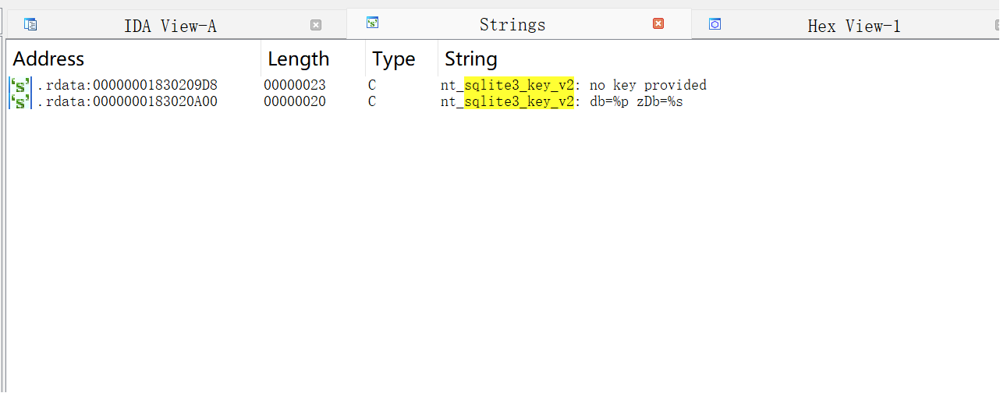
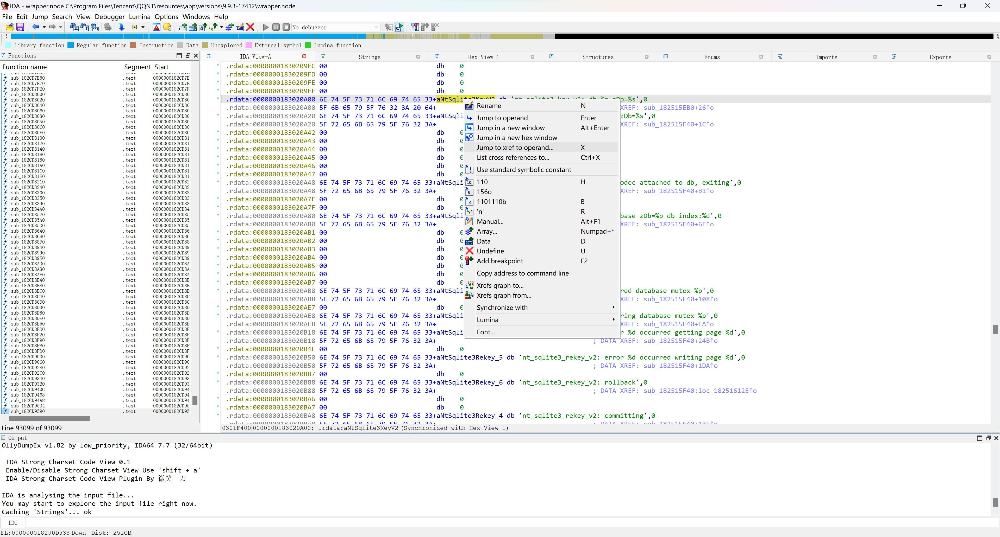
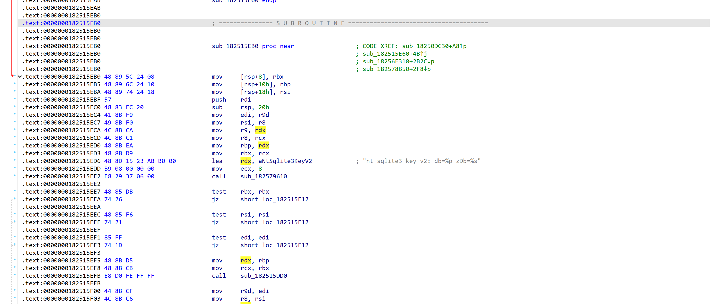
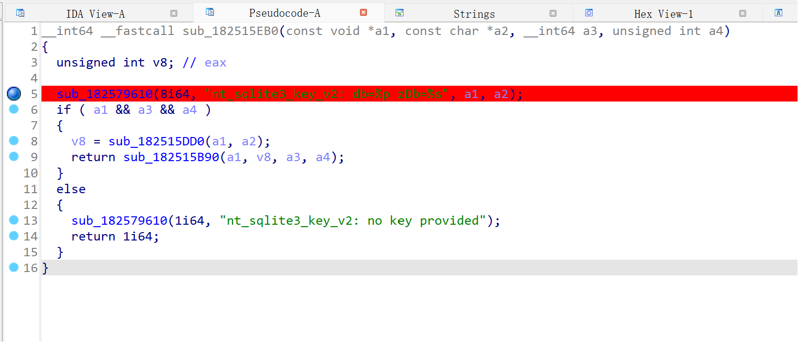
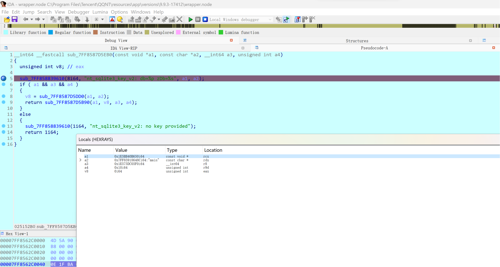
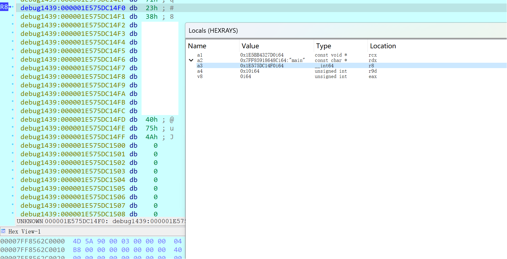
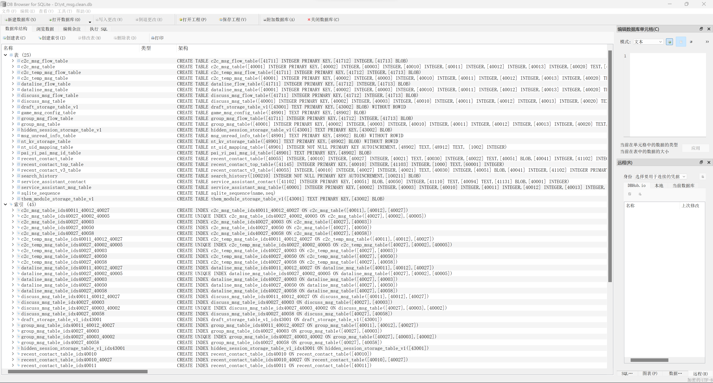

# QQ NT Windows 数据库解密+图片/文件清理

笔者测试时使用的 QQ 版本：9.9.3-17412

## 找到数据库 `passphrase`

1. 使用 IDA Pro 打开 `C:\Program Files\Tencent\QQNT\resources\app\versions\9.9.3-17412\wrapper.node`。打开 Strings 视图，搜索 `sqlite3_key_v2`

    

2. 跳转到主视图，再跳转到引用该字符串的位置

    

    

3. 反编译此函数

    

    参考[文档](https://www.zetetic.net/sqlcipher/sqlcipher-api/#sqlite3_key)可知 `sqlite3_key_v2` 的参数为：

    ```c
    int sqlite3_key_v2(
        sqlite3 *db,                   /* Database to be keyed */
        const char *zDbName,           /* Name of the database */
        const void *pKey, int nKey     /* The key */
    );
    ```
   
    可以猜测 a3 为我们所需的 `passphrase`。打上断点

4. 退出 QQ 并重新打开，但不要登录。使用 IDA Debug 的 Attach to Process 功能，附加到 QQ 进程。之后登录，可以看到断点被命中

    

    打开一个 Locals 视图查看参数的值

5. 每次命中后，跳转到 a3 对应的位置，直到看到如下图所示的 16 位字符串。`#8xxxxxxxxxxx@uJ` 即为我们需要的 `passphrase` (qq版本不同，不一定是这个格式，但总字符数是一样的)

    

## 导出/修复数据库

数据库位置：`C:\Users\Myth\Documents\Tencent Files\<QQ>\nt_qq\nt_db`

考虑到在 Windows 上编译 sqlcipher 较为困难，笔者使用了 MSYS2 环境并直接安装了`mingw-w64-x86_64-sqlcipher`

首先，数据库文件头部有 1024 个字符的纯文本内容，去除这部分内容：

```bash
cat nt_msg.db | tail -c +1025 > nt_msg.clean.db
```

笔者处理了 `nt_msg.db`、`files_in_chat.db` 两个文件，并将处理后的文件移动到 `data/clean_db`

根据 sqlcipher 的文档，解密数据的流程为：

1. 打开数据库

    ```bash
    $ sqlcipher
    sqlite> .open nt_msg.clean.db
    ```
   
2. 输入 `passphrase`

    ```bash
    sqlite> PRAGMA key = '#8xxxxxxxxxxx@uJ'; PRAGMA kdf_iter = '4000';
    ```

3. 导出无加密的数据库

    ```bash
    sqlite> ATTACH DATABASE 'nt_msg.db' AS plaintext KEY ''; SELECT sqlcipher_export('plaintext'); DETACH DATABASE plaintext;
    sqlite> .exit 
    ```

不过，很有可能在导出时提示数据库损坏 `Runtime error: database disk image is malformed`。此时需要对数据库进行修复：

```bash
sqlite> .output nt_msg.sql
sqlite> .dump
sqlite> .exit
```

之后对得到的 `nt_msg.sql` 进行处理，并使用 `sqlite3` 生成无加密的数据库

```bash
$ cat nt_msg.sql | sed -e 's|^ROLLBACK;\( -- due to errors\)*$|COMMIT;|g' | sqlite3 nt_msg.db
```
将解密后的数据库移动到 `data/decrypted_db`

## 图片/文件清理

下图是 `nt_msg.db` 中的表：



注意 `c2c/group_msg_table` 中的 `40800`（消息内容）是 Protobuf 二进制。笔者暂时没有弄明白每个字段的意义

图片/文件清理可以参考仓库中的两个 Python 脚本

## 致谢

[QQBackup/qq-win-db-key](https://github.com/QQBackup/qq-win-db-key)

[https://lengyue.me/2023/09/19/ntqq-db/](https://lengyue.me/2023/09/19/ntqq-db/)
